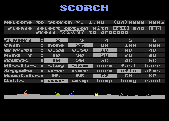
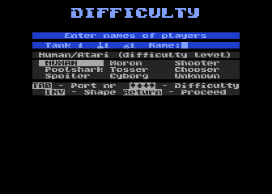
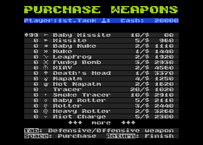
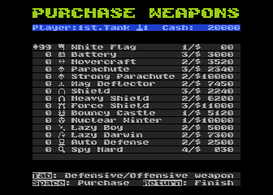
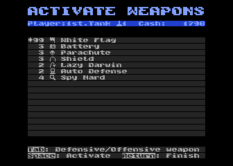

# Podstawowa instrukcja:

Grać można przy użyciu klawiatury (wszystkie funkcjonalności) lub joysticka (wszystkie funkcjonalności niezbędne w rozgrywce).

## 1. Wybór opcji gry.

Na pierwszym ekranie możemy skonfigurować opcje rozgrywki:

* liczba graczy (2 - 6) obejmuje tak ludzi, jak graczy sterowanych przez komputer

* początkową ilość gotówki każdego z graczy (8k to wybrana przez nas wartość optymalna, lecz przy krótkich rozgrywkach warto wybrać większą wartość)

* grawitacja

* maksymalna siła wiatru w skali Beauforta (wiatr jest losowany na początku każdej z rund lub w czasie rundy pomiędzy turami, tu możemy wybrać jak silny może być):
    * 1B - maksymalna siła wiatru: 5
    * 3B - maksymalna siła wiatru: 20
    * 5B - maksymalna siła wiatru: 40
    * 7B - maksymalna siła wiatru: 70
    * 9B - maksymalna siła wiatru: 99

* liczba rozgrywanych rund

* szybkość lotu pocisków (nie ma wpływu na tor lotu - zmienia jedynie widoczną prędkość rysowania - nie zmienia nic w samej rozgrywce)

* częstotliwość samobójstw :) - jeśli przez ileś tur gra nie odnotowała trafień (czołgi ciągle strzelają niecelnie) jeden z takich pudłujących czołgów popełnia samobójstwo - tu określamy jak długo mogą "strzelać w próżnię" :) - jeśli grają tylko ludzie, optymalne ustawienie to "norm", a w przypadku graczy sterowanych przez komputer... wedle uznania.

* wysokość (i pofałdowanie) gór od prawie płaskich (NL - Królestwo Niderlandów), do strzelistych i wysokich (NP - Federalna Demokratyczna Republika Nepalu)

* sposób działania ścian (krawędzi ekranu):
    * none - pociski, które wyleciały poza ekran nie wracają (czarny kolor ramki ekranu)
    * wrap - ekran "zawija się" i pociski, które wyleciały w prawo pojawiają się z lewej strony i odwrotnie (fioletowy kolor ramki ekranu)
    * bump - prawa i lewa ściana odbijają pociski, które chcą przez nie przelecieć (granatowy kolor ramki ekranu)
    * boxy - tak jak bump, tyle że "sufit" także odbija pociski (zielony kolor ramki ekranu)
    * rand - na początku każdej rundy losowany jest jeden z 4 powyższych sposobów działania ścian
    
    W trakcie rozgrywki aktualny sposób działania ścian reprezentowany jest przez kolor ramki ekranu: none - czarny, wrap - fioletowy, bump - granatowy, boxy - zielony.

Wybór opcji klawiszami kursora lub joystickiem.

Klawisz [TAB], [SELECT] lub drugi przycisk joysticka (wspierany standard Joy 2B+ lub zgodny), a na konsoli Atari 5200 klawisz [5] kontrolera zmieniają kolor gór (3 wersje do wyboru).  

Jeśli kursor wskazuje opcję wyboru siły wiatru "Wind" zmienia sposób losowania siły wiatru z "co rundę" na "co turę" i odwrotnie. Losowanie co turę jest sygnalizowane znakiem "?" przy słowie "Wind".  

Jeśli kursor wskazuje opcję wyboru siły ciążenia "Gravity" zmienia procedurę opadania ziemi na mniej efektowną, ale szybszą i odwrotnie. Wybranie szybkiego opadania ziemi sygnalizowane jest literą "f" przy słowie "Gravity".

Klawisz [RETURN] lub przycisk joysticka przechodzi do następnego ekranu.

## 2. Gracze i poziom przeciwników

Wprowadzanie nazw graczy i wybór poziomu graczy sterowanych przez komputer.

Drugi ekran powtarza się dla każdego z graczy, można na nim klawiszami kursora lub joystickiem wybrać czy danym czołgiem będzie kierował człowiek (opcja HUMAN), czy też komputer (pozostałe opcje).  

Klawisz [TAB], [SELECT] lub drugi przycisk joysticka, a na konsoli Atari 5200 klawisz [5] kontrolera pozwalają wybrać z którego portu joysticka będzie korzystał gracz.  

Klawisz [INVERSE] lub [OPTION] umożliwiają wybór jednego z 3 dostępnych kształtów czołgów. Na konsoli Atari 5200 uzyskuje się to poprzez cykliczne wybieranie kolejnych portów joysticka klawiszem [5].  

Jednocześnie z klawiatury można wprowadzić nazwę wybranego gracza.  

Po naciśnięciu klawisza [RETURN] lub krótkim naciśnięciu przycisku joysticka ekran przechodzi na następnego gracza aż zostaną wybrane poziomy trudności dla wszystkich.

Nazwę gracza można wprowadzać także przy pomocy joysticka. Po wciśnięciu i przytrzymaniu przycisku ponad 1s. za pomocą ruchów góra/dół można zmienić wprowadzaną literę, a lewo/prawo jej pozycję w nazwie. Puszczenie przycisku kończy wprowadzanie nazwy i wraca do wyboru poziomu.

Jeśli nazwa nie zostanie wpisana, to zostanie uzupełniona nazwą domyślną.

## 3. Ekran zakupów (przed każdą rundą)

Na tym ekranie można dokonywać zakupów broni ofensywnych i defensywnych. Widoczne są tylko te bronie, na które gracza stać wraz z informacją o cenie i ilości jednostek danej broni, którą za tę cenę otrzymamy. Informacje na ekranie nie wymagają chyba więcej opisu. Po listach poruszamy się klawiszami kursora (góra i dół) lub joystickiem, klawisz [TAB] lub strzałka w lewo, czy też ruch joystickiem w lewo lub drugi przycisk joysticka zmieniają ekran na bronie defensywne lub ofensywne, klawisz [SPACJA] lub strzałka w prawo, a także joystick w prawo realizują zakup wskazanej broni.

Klawisz [RETURN] lub przycisk joysticka przechodzi do ekranu aktywacji broni defensywnych.

Na ekranie tym można aktywować zakupione wcześniej bronie defensywne czy też ofensywne. Obsługiwany jest identycznie jak ekran zakupów, jednak [SPACJA] lub strzałka w prawo, a także joystick w prawo realizują aktywacje wskazanej broni. Umożliwia to aktywowanie osłon jeszcze przed rozpoczęciem rundy.

Klawisz [RETURN] lub przycisk joysticka przechodzi do ekranu zakupów następnego gracza.
(oczywiście dla graczy komputerowych ten ekran się nie pojawia)

## 4. Główny ekran gry

W linii statusowej widoczna jest informacja o tym, który z graczy aktualnie może oddać strzał oraz zestaw innych informacji:

* nazwa czołgu gracza

* numer aktywnego joysticka lub poziom gracza sterowanego przez komputer (1-**Moron** - 8-**Unknown**),

* wybrana aktualnie broń ofensywna (symbol - ilość - nazwa),

* pozostała ilość punktów energii gracza i jeśli ma on aktywną broń defensywną posiadającą swój zasób energii - w nawiasie ten zasób

* ustawiony przez gracza kąt nachylenia lufy i kierunek jej nachylenia

* ustawiona przez gracza siła strzału (maksymalna siła strzału jest ograniczana przez energię gracza - nie może przekroczyć energii * 10 . Oznacza to, że mając małą ilość energii możemy oddać słabsze strzały

* numer aktualnej rundy rozgrywki

* prędkość i kierunek wiatru

* symbol "komputera" jeśli aktywna jest **Auto Defense**

* w nawiasie nazwę aktywnej broni defensywnej - jeśli jest jakaś aktywowana przez gracza

Tutaj klawiszologia jest prosta, klawisze kursora lub joystick: lewo/prawo - zmiana kąta nachylenia lufy, góra/dół - zmiana ustawienia siły strzału.

| A800             | 5200    | funkcja |
|------------------|---------| ------- |
| [SPACJA]         | [0]     | lub przycisk joysticka naciśnięte krótko - oddanie strzału |
| [TAB]/[SELECT]   | [5]     | lub drugi przycisk joysticka - wybór broni ofensywnej (ta opcja nie jest dostępna bezpośrednio standardowym joystickiem - trzeba wybrać Inventory). |
| [I]              | [9]     | lub dłuższe przytrzymanie przycisku joysticka - przejście do Inventory (aktywacji broni). Inventory to ekran (a w zasadzie dwa) bliźniaczo podobny do ekranu zakupów. Zasady poruszania się są identyczne - z tym, że tu nie kupujemy broni, ale wybieramy jedną z ofensywnych, którą będziemy strzelać lub aktywujemy broń defensywną. |
| [A]/[OPTION]     | [7]     | bezpośrednie przejście na ekran Inventory aktywacji broni defensywnych. |
| [M]              | [PAUSE] | wyłączenie/włączenie muzyki w tle |
| [S]              | [RESET] | wyłączenie/włączenie dźwięków efektów |
| [START]          | brak    | przyspiesza/pomija niektóre animacje w grze |
| [O]              | [3]     | wymuszenie zakończenia gry (Game Over). W podsumowaniu wyników nie jest brana pod uwagę przerwana właśnie runda rozgrywki, a wyłącznie rundy zakończone wcześniej. Odpowiada to wciśnięciu klawisza [ESC] z tą różnicą, że wyświetlane jest podsumowanie oraz creditsy. |
| [START]+[OPTION] | brak    | natychmiastowe wymuszenie zakończenia gry (Game Over), tak jak [O], ale bez potwierdzenia. |
| [G]              | brak    | zmienia wariant kolorystyczny gór (3 wersje do wyboru) |
| [ESC]            | [*]     | w czasie całej gry w dowolnym momencie (chyba że akurat gra komputer, wtedy czasem trzeba chwilę poczekać) można nacisnąć klawisz [ESC], który umożliwia przerwanie gry i powrót na początek (oczywiście jest zabezpieczenie przed przypadkowym naciśnięciem). |
| [Y]              | [1]     | w przypadku pytania o przerwanie lub zakończenie gry - potwierdzenie decyzji |
| [CTRL]+[HELP]    | brak    | Przełącza tryb "visual debug". Wizualizuje mierzone odległości, celowanie lasera oraz technikę celowania komputera. Pozostawia bałagan na ekranie, co nie zmienia rozgrywki, tylko ją nieco utrudnia. |

## 5. Zasady gry - bronie ofensywne

### Energia czołgów
* Na początku każdej rundy każdy czołg ma 99 jednostek energii.

* Energii czołgom ubywa na 3 sposoby: 
    * jedna jednostka po oddaniu każdego strzału
    * w czasie spadania (jeden piksel w dół -2 jednostki)
    * w chwili trafienia w czołg lub obok niego jakiegoś pocisku - i tu ilość odejmowanej energii zależy od odległości od centrum eksplozji i typu/siły rażenia pocisku.

### Energia i kasa
Jak działa odejmowanie energii i zarabianie kasy:
Po każdej rundzie wyliczana jest ilość zdobytych/straconych pieniędzy, robione jest to na podstawie dwóch zmiennych gromadzonych przez każdy z czołgów w trakcie rundy. Te zmienne to:

`gain` - energia "przechwycona" od trafionych czołgów (także jeśli trafimy w samego siebie :) i tu haczyk, jeśli pozostało nam bardzo mało energii opłacalne może być trafienie w siebie mocną bronią!

`lose` - energia stracona w wyniku eksplozji/upadku (i tu ważne - liczona jest całkowita utrata energii nawet jeśli czołg ma w chwili trafienia mniej).

Dodatkowo czołg, który wygrał rundę, ma parametr gain (przechwyconej od trafionych czołgów energii) zwiększany o pozostałą mu na koniec rundy energię (bo nie zginął i powinien ją mieć - choć bywa też inaczej :) )

Konkretnie:

### Po każdej rundzie:
`money = money + (20 * (gain+energy))`

`money = money - (10 * lose)`

`jeśli money <0 to money=0`

(na starcie każdej rundy `gain` i `lose` mają wartość 0)

W czasie rundy, jeśli w wyniku strzału oddanego przez czołg inny czołg zostanie trafiony, czołg oddający strzał "dostaje energię" zabraną czołgowi trafionemu.

### czołg oddający strzał:
`gain = gain + EnergyDecrease`

### czołg trafiony:
`lose = lose + EnergyDecrease`

gdzie `EnergyDecrease` to utrata energii w wyniku trafienia.

Oczywiście jednocześnie trafiony czołg traci ilość energii zapisaną w `EnergyDecrease`, z tym że tutaj strata nie może przekroczyć posiadanej energii.

## Jak działa trafienie.

Każda broń, która skutkuje eksplozją, ma swój promień rażenia.

Po eksplozji każdy czołg w jej zasięgu traci energię.

Działa to tak, że jeśli trafienie jest dokładnie w centralny punkt czołgu, `EnergyDecrease` otrzymuje maksymalną wartość dla danej broni, a z każdym pikselem odległości od centrum czołgu wartość ta jest zmniejszana o 8.

Przykładowo: jeśli strzał oddany za pomocą broni Baby Missile trafi idealnie w centrum czołgu, to straci on dokładnie 88 jednostek energii (plus to, co straci spadając po eksplozji).
W przypadku trafienia tą samą bronią w odległości 10-ciu pikseli od centrum czołgu strata ta będzie wynosiła już tyko 8 jednostek.

A oto wartości maksymalnego ubytku energii dla poszczególnych broni. Jeśli broń eksploduje kilka razy, każda z eksplozji jest obliczana niezależnie (dodatkowe wartości w tabeli):

| Broń ofensywna  | Max ubytku energii |
|-----------------|--------------|
| Baby Missile    | 88           |
| Missile         | 136          |
| Baby Nuke       | 200          |
| Nuke            | 240          |
| LeapFrog        | 136 112 112  |
| Funky Bomb      | 168 88 (*5)  |
| MIRV            | 136 (*5)     |
| Death's Head    | 240 (*5)     |
| Napalm          | 40 (zob. ↓)  |
| Hot Napalm      | 80 (zob. ↓)  |
| Baby Roller     | 88           |
| Roller          | 168          |
| Heavy Roller    | 240          |
| Riot Charge     | 0 (zob. ↓)   |
| Riot Blast      | 0 (zob. ↓)   |
| Riot Bomb       | 0 (zob. ↓)   |
| Heavy Riot Bomb | 0 (zob. ↓)   |
| Baby Digger     | 0 (zob. ↓)   |
| Digger          | 0 (zob. ↓)   |
| Heavy Digger    | 0 (zob. ↓)   |
| Sandhog         | 0 (zob. ↓)   |
| Heavy Sandhog   | 0 (zob. ↓)   |
| Dirt Clod       | 0 (zob. ↓)   |
| Dirt Ball       | 0 (zob. ↓)   |
| Ton of Dirt     | 0 (zob. ↓)   |
| Liquid Dirt     | 0 (zob. ↓)   |
| Dirt Charge     | 0 (zob. ↓)   |
| Stomp           | 0 (zob. ↓)   |
| Laser           | 100 (zob. ↓) |

Uwagi:
* **Napalm** - ta broń jest inna i nie jest wyznaczana odległość od centrum, po prostu każdy czołg znajdujący się w zasięgu płomieni traci 40 jednostek energii

* **Hot Napalm** - zasada taka jak w Napalm

* **Riot Charge** - nie jest odejmowana energia, ale usuwana jest część gruntu w górę od punktu trafienia w promieniu 31 pikseli

* **Riot Blast** - jak w Riot Charge, tyle że w promieniu 61 pikseli

* **Riot Bomb** - nie jest odejmowana energia, ale niszczony jest grunt w promieniu 17 pikseli od punktu trafienia - tak jak w wypadku **Missile**. Broń przydatna do odkopywania się po zasypaniu, bądź podkopywania przeciwnika

* **Heavy Riot Bomb** - jak w Riot Bomb, ale promień eksplozji to 29 pikseli od punktu trafienia - tak jak w wypadku **Nuke**

* **Baby Digger** - nie jest odejmowana energia, ale podkopywana jest część gruntu promieniu 60 pikseli od punktu trafienia

* **Digger** - jak wyżej - większy podkop

* **Heavy Digger** - jak wyżej - największy podkop

* **Sandhog** - jak wyżej - inny sposób podkopywania

* **Heavy Sandhog** - jak wyżej - największy podkop

* **Dirt Clod** - nie jest odejmowana energia, ale tworzona jest kula gruntu o promieniu 12 pikseli od punktu trafienia. Broń przydatna do zakopywania przeciwnika.

* **Dirt Ball** - jak wyżej, ale promień kuli to 22 piksele

* **Ton of Dirt** - jak wyżej, ale promień kuli to 31 pikseli

* **Liquid Dirt** - zalewa grunt w punkcie trafienia płynną glebą, wypełniając zagłębienia

* **Dirt Charge** - nie jest odejmowana energia, ale usypywany jest dodatkowy grunt w górę od punktu trafienia w promieniu 61 pikseli. Broń przydatna do zakopywania przeciwnika.

* **Stomp** - nie jest odejmowana energia, ale wszystkie czołgi w promieniu zależnym od siły strzału zostają odepchnięte, a po odepchnięciu mogą spaść lub zostać zasypane. Przy maksymalnej sile 990 jednostek promień działania to około 60 pikseli.

* **Laser** - tu także jest inaczej - równo 100 tylko w przypadku bezpośredniego trafienia po prostu odejmujemy 100 jednostek energii - czyli czołg zawsze ginie.

Duże punkty otrzymane przez gracza to liczba czołgów, które zginęły wcześniej niż on. Jeśli któryś z innych czołgów skapitulował wcześniej (Biała Flaga) nie jest doliczany do tych, które zginęły, i nie daje punktów.

Tylko te punkty decydują o kolejności w podsumowaniu.

## 6. A teraz bronie defensywne:

* **White Flag** - powoduje poddanie gracza (może czasem przydać się w sytuacji beznadziejnej). Zaletą jest to, że poddając się nie dajemy dużego punktu przeciwnikom i nie powodujemy, że któryś zyska na tym, że nas zgładzi, ograniczamy też stratę swojej energii, czyli także kasy. I tu także ważna uwaga - to jedyna broń defensywna, którą można dezaktywować. Wystarczy ponownie wejść do inventory i jeszcze raz wybrać jej aktywację.

* **Battery** - w momencie aktywacji doładowuje energię czołgu do pełna (99 jednostek). Jest to jedna z trzech broni defensywnych, która nie dezaktywuje innych broni defensywnych w przypadku jej użycia.

* **Hovercraft** - broń umożliwiająca przemieszczanie się czołgu. Posiada własny zasób paliwa, a dodatkowo może być aktywowana wielokrotnie w czasie tej samej tury, a po jej użyciu możemy w tej samej turze aktywować inną broń defensywną i oddać strzał. W wyniku jej użycia czołg uniesie się ponad góry i za pomocą klawiszy kursora lub joysticka: lewo/prawo możemy przemieścić czołg na nową pozycję, a [SPACJA] lub przycisk joysticka powodują wylądowanie czołgu w nowym miejscu. Latać można do chwili skończenia się "paliwa" (prezentowanego na pasku statusu tak jak energia broni defensywnej), a gdy paliwo się skończy, czołg opadnie samodzielnie. Nie da się lądować na innych czołgach.

* **Parachute** - nie chroni przed ubytkiem energii z powodu sąsiedniej eksplozji, powoduje że nie ubywa energii w czasie JEDNEGO spadania. Po takim upadku dezaktywuje się i trzeba aktywować nowy spadochron.

* **Strong Parachute** - spadochron z własną energią (na starcie 99 jednostek), działa tak samo jak Parachute (nie chroni przed eksplozjami), ma za to swój własny zasób energii, przy spadaniu w pierwszej kolejności zmniejszana jest energia tego spadochronu (1 jednostka na jeden piksel opadania - inaczej niż czołg!) i jeśli dojdzie ona do 0, to spadochron dezaktywuje się i dalej zmniejszana jest energia czołgu (tutaj już standardowo - 2 jednostki na jeden piksel).

* **Shield** - najprostsza osłona, działa dokładnie przeciwnie niż Parachute, nie chroni przed ubytkiem energii w czasie spadania, chroni za to przed ubytkiem energii spowodowanym JEDNĄ sąsiednią eksplozją. Chroni jednorazowo, bez znaczenia jak silna jest eksplozja (czy jest to tylko "draśnięcie", czy też bezpośrednie trafienie atomówką) i od razu po niej dezaktywuje się.

* **Heavy Shield** - osłona z własną energią (na starcie 99 jednostek), działa tak samo jak Shield (nie chroni przed upadkiem) z tym wyjątkiem, że ma własny zasób energii. Przy eksplozji w pierwszej kolejności zmniejszana jest energia tej osłony i jeśli dojdzie ona do 0, to osłona dezaktywuje się i dalej zmniejszana jest energia czołgu. W związku z takim działaniem, czołg z tym typem osłony można "zabić" podkopując go, bo spadanie zmniejsza energię czołgu a nie osłony.

* **Force Shield** - najmocniejsza osłona - działa tak jak Heavy Shield, tyle że połączona z Parachute. Co ważne, w jej przypadku upadek nie zabiera energii osłonie ani czołgowi. Zabierają ją tylko trafienia.

* **Bouncy Castle** - broń agresywna :) Działa następująco: w przypadku bezpośredniego trafienia w czołg (i osłonę) powoduje "odbicie" pocisku w przeciwnym kierunku z taką samą siłą, z jaką był wystrzelony. W przypadku braku wiatru i różnicy poziomów broń trafia wtedy w czołg, który ją wystrzelił. Po takim odbiciu dezaktywuje się. W związku z tym, że broń ta reaguje w ten sposób tylko na precyzyjne trafienia, jest także osłoną odpowiadającą działaniu Heavy Shield i ma na starcie 99 jednostek (prawdopodobnie trzeba będzie przemyśleć tę wartość i dać tu mniejszą).

* **Mag Deflector** - druga broń agresywna :) W przypadku bezpośredniego trafienia w czołg (i osłonę) powoduje przesunięcie punktu trafienia losowo w lewo lub prawą stronę chronionego czołgu, ale niezbyt daleko, więc można dostać "odłamkiem" przy silniejszej broni. Tak jak w przypadku Bouncy Castle jest także osłoną odpowiadającą działaniu Heavy Shield i ma na starcie 99 jednostek (prawdopodobnie i tutaj trzeba będzie przemyśleć tę wartość i dać mniejszą).

* **Nuclear Winter** - nic nie dodaje, nic nie zabiera :) - w zasadzie to broń nie tyle defensywna, co obosieczna. Zasypuje teren opadem "radioaktywnym", który jest zwyczajną glebą. Jeśli nie mamy pod ręką żadnej broni odkopującej teren i do tego osłony (najlepiej jednorazowej), to po takim "opadzie" będzie trzeba strzelić do siebie - bo będąc pod ziemią inaczej się nie da. Ewentualnie pozostaje zawsze White Flag.

* **Long Schlong** - broń specjalna :) - kosztuje dużo, nie bardzo w czymkolwiek pomaga (poza ewentualnym odkopaniem się - tylko przy niewielkim przysypaniu - ale fajnie się nazywa i wygląda :) - Można ją aktywować niezależnie od innych broni defensywnych i pozostaje aktywna do końca rundy (nie da się jej dezaktywować).

* **Lazy Boy** - nie jest to właściwie broń defensywna. Jest to wspomaganie celowania. Po jej aktywacji czołg stara się wycelować w najbliższego przeciwnika i automatycznie ustawia siłę strzału oraz kąt. W przypadku posiadania zbyt małej ilości energii może czasem wycelować źle (do celowania stosuje metodę taką jak **Cyborg**). Tak jak **Battery** nie dezaktywuje innych broni defensywnych w przypadku jej użycia. Uwaga! Nie ma sensu aktywacja tej broni przed rundą, celowanie nie odbędzie się, bo nie ma jeszcze do czego celować.

* **Lazy Darwin** - działa tak jak **Lazy Boy**, ale celuje w najsłabszego przeciwnika. W tej broni po automatycznym celowaniu pozostaje aktywne "celowanie wizualne" można więc łątwo zmienić cel i samodzielnie wybrać innego przeciwnika widząc czy w niego trafimy.

* **Auto Defense** - włącza tryb automatycznej aktywacji broni defensywnych. Po jej aktywowaniu czołg automatycznie aktywuje najmocniejszą posiadaną osłonę (zużywając ją oczywiście) w każdej chwili, kiedy nie ma żadnej osłony (także pomiędzy strzałami innych graczy). Jednocześnie jeżeli poziom energii czołgu spadnie poniżej 30 jednostek, automatycznie aktywuje **Battery** jeżeli ją posiada. Ta broń pozostaje aktywna do końca rundy i jest sygnalizowana symbolem "komputera" przed nazwą aktywnej broni defensywnej w linii statusowej. Jest to druga broń defensywna, która nie dezaktywuje innych broni defensywnych w przypadku jej użycia.

* **Spy Hard** - Pomoc dla zapominalskich :) Po aktywacji pokazuje kolejno podgląd informacji o kolejnych przeciwnikach. Lewo/Prawo - zmienia "szpiegowany" czołg. Fire/Space/Return/Esc - kończy "szpiegowanie". Jest to ostatnia broń defensywna, która nie dezaktywuje innych broni defensywnych w przypadku jej użycia.

W związku z odmiennym działaniem broni **MIRV**, bronie defensywne **Bouncy Castle** i **Mag Deflector** wykorzystują tylko funkcję osłony przy trafieniu tą bronią. Dodatkowo głowice **MIRV** w czasie opadania nie odbijają się i nie przelatują przez ściany boczne!

Żadna z osłon nie chroni przed **Napalm**. **Bouncy Castle** czy **Mag Deflector**, przy bezpośrednim trafieniu odbije je lub przeniesie obok, ale wystarczy trafić bardzo blisko czołgu i nie zadziała jego osłona.

Bronie **White Flag**, **Hovercraft** i **Nuclear Winter** po aktywacji wymagają uruchomienia, jest to realizowanie przez "oddanie strzału" po aktywacji tej broni. Oczywiście strzał bronią ofensywną nie jest wtedy oddawany, a jedynie uruchamiana jest wybrana broń defensywna.

Można mieć aktywną tylko jedną broń defensywną w danej chwili (za wyjątkiem **Long Schlong** oczywiście :) ). Zawsze przed oddaniem strzału możemy zmienić decyzję i aktywować inną broń defensywną czy też dezaktywować **White Flag**.

Oczywiście aktywacja broni w momencie, kiedy mamy już aktywowaną jakąś inną, powoduje utratę tej poprzedniej (nie ma zwrotów :) ).

## 7. Bronie 'inne' :) :

* **Best F...g Gifts** - tej 'broni' nie używa się w rozgrywce. Jej zakup powoduje wylosowanie jednej z broni ofensywnych lub (rzadziej) defensywnych i dodanie jej do arsenału gracza. Jest to loteria, w której można stracić (jeśli wylosuje się broń tańsza niż cena **Best F...g Gifts**), ale też zyskać. Jeśli wylosuje się broń dużo droższa, możemy otrzymać do dyspozycji broń, na którą nie było nas stać! Istnieje niewielkie prawdopodobieństwo wylosowania przez **Best F...g Gifts** samej siebie :). Można wtedy spróbować użyć jej w walce.

## 8. Siła przeciwników AI:

Gra posiada 8 poziomów trudności przeciwników sterowanych przez komputer. A właściwie 7 różnych i jeden "niespodziankę". Każdy z nich ma swój sposób kupowania broni defensywnych i ofensywnych oraz inną metodę wyboru celu i samego celowania oraz wyboru broni. Ułożone są one na liście według wzrastających "umiejętności":

* **Moron** - najgłupszy z przeciwników (co nie znaczy, że najbezpieczniejszy). Strzela całkowicie przypadkowo używając wyłącznie jednej broni - **Baby Missile**. Nie kupuje nic, nie umie stosować broni defensywnych.

* **Shooter** - Ten przeciwnik nie strzela na oślep. Wybiera sobie jeden kierunek. Na podstawie własnej pozycji - strzela w stronę, z której jest więcej przestrzeni zakładając, że to tam są inne czołgi. Ostrzeliwanie zaczyna od wysokiego kąta i strzał po strzale zmienia ten kąt na coraz niższy starając się ostrzelać cały obszar po wybranej stronie. Strzał oddaje zawsze najlepszą posiadaną bronią (najwyższą na liście posiadanych broni - czyli niekoniecznie najlepszą). Nie używa broni defensywnych mimo, że je kupuje! Na początku rundy podejmuje 1 próbę zakupu broni defensywnych (tylko z zakresu **Battery** - **Strong Parachute**) i 4 ofensywnych (z zakresu **Missile** - **Heavy Roller**).

* **Poolshark** - Atakując wyznacza sobie za cel najbliższy czołg, następnie dobiera kąt strzału, a jego siłę stara się dobrać losując ją z wybranego przedziału. Strzał oddaje zawsze najlepszą posiadaną bronią. Używa broni defensywnych. Z prawdopodobieństwem 1:3 aktywuje przed oddaniem strzału najlepszą posiadaną broń defensywną (najwyższą na liście posiadanych broni - czyli niekoniecznie najlepszą). Jeżeli poziom jego energii spadnie poniżej 30 jednostek - używa **Battery** (oczywiście jeśli wcześniej ją kupił), a jeżeli energia spadnie poniżej 5 i nie ma **Battery**, poddaje się - **White Flag**. Na początku rundy podejmuje 1 próbę zakupu broni defensywnych i 6 ofensywnych.

* **Tosser** - Atakując działa dokładnie tak jak **Poolshark**, jednak może posiadać "lepszy" zasób broni dzięki innej taktyce zakupów. Zawsze przed strzałem aktywuje najlepszą posiadaną broń defensywną. i tak jak **Poolshark** stosuje **Battery** i **White Flag**. Na początku rundy ocenia ile ma pieniędzy i w zależności od tego podejmuje (pieniądze/5100) prób zakupu broni defensywnych, a następnie jeszcze raz sprawdza ile pieniędzy mu zostało i podejmuje (pieniądze/1250) prób zakupu broni ofensywnych.

* **Chooser** - Obiera sobie za cel najsłabszego przeciwnika (o najmniejszym zasobie energii) i celuje bardzo dokładnie, jednak przed samym strzałem energia strzału modyfikowana jest o parametr szczęścia :) , czyli mimo precyzyjnego wycelowania nie zawsze trafia. Strzał oddaje najlepszą posiadaną bronią - chyba że cel jest blisko, wtedy zmienia broń na **Baby Missile**, by unikać trafienia samego siebie. Zawsze przed strzałem aktywuje najlepszą posiadaną broń defensywną i tak jak **Poolshark** stosuje **Battery** i **White Flag**. Zakupów dokonuje tak samo jak **Tosser**.

* **Spoiler** - Strzela dokładnie tak jak **Chooser**, tyle że ma więcej szczęścia :), co oznacza, że nawet jeśli nie trafi w wybrany cel, to może być to strzał precyzyjniejszy niż **Chooser**. Jeśli nie jest w stanie trafić w obrany cel, stara się wybrać inny, w który może precyzyjnie trafić. Broni defensywnych używa dokładnie tak jak **Chooser**. Na początku rundy ocenia ile ma pieniędzy i w zależności od tego podejmuje (pieniądze/5100) prób zakupu broni defensywnych, a następnie jeszcze raz sprawdza ile pieniędzy mu zostało i podejmuje (pieniądze/320) prób zakupu broni ofensywnych. Przy zakupie broni defensywnych kupuje tylko bronie silne i precyzyjne - czyli takie, które nie zrobią mu przypadkiem krzywdy.

* **Cyborg** - Obiera sobie za cel najsłabszego przeciwnika (o najmniejszym zasobie energii), lecz preferuje przeciwników sterowanych przez człowieka. Jeśli nie jest w stanie trafić w obrany cel, stara się wybrać inny, w który może precyzyjnie trafić. Celuje bardzo dokładnie i w zdecydowanej większości przypadków trafia za pierwszym strzałem. Strzał oddaje najlepszą posiadaną bronią - chyba że cel jest blisko, wtedy zmienia broń na **Baby Missile**, by unikać trafienia samego siebie. Broni defensywnych używa dokładnie tak jak **Chooser**, ale jeśli ma więcej niź 2 sztuki **Battery**, stosuje je jeśli energia zmniejszy się poniższej 60 jednostek. Zakupy robi dokładnie tak jak **Spoiler**

* **Unknown** - Przed oddaniem każdego strzału losowo wybiera sposób działania od **Poolsharka** do **Cyborga** i stosuje jego taktykę. Taktyka zakupów broni jest jednak zawsze identyczna jak  **Tosser**

Próba zakupu broni (ofensywnej lub defensywnej) wygląda następująco:

Na początku losowana jest jedna z broni (wśród wszystkich możliwych ofensywnych lub defensywnych). Następnie wykonywane jest sprawdzenie, czy wylosowana broń jest na liście broni możliwych do zakupu przez czołg. Jeśli nie, to w tej próbie żadna broń nie jest kupowana, a jeśli tak, to sprawdzana jest jej cena. Jeśli czołg ma tyle pieniędzy, broń jest kupowana, w przeciwnym wypadku próba kończy się bez dokonania zakupu.

Tabela broni kupowanych przez **Shooter**, **Poolshark**, **Tosser** i **Chooser**

| bronie ofensywne | bronie defensywne |
|------------------|-------------------|
| Missile          | Battery           |
| Baby Nuke        | Parachute         |
| Nuke             | Strong Parachute  |
| LeapFrog         | Mag Deflector     |
| Funky Bomb       | Shield            |
| MIRV             | Heavy Shield      |
| Death's Head     | Force Shield      |
| Napalm           | Bouncy Castle     |
| Hot Napalm       |                   |
| Baby Roller      |                   |
| Roller           |                   |
| Heavy Roller     |                   |

Tabela broni kupowanych przez **Spoiler** i **Cyborg**

| bronie ofensywne | bronie defensywne |
|------------------|-------------------|
| Missile          | Battery           |
| Baby Nuke        | Strong Parachute  |
| Nuke             | Mag Deflector     |
| Hot Napalm       | Heavy Shield      |
|                  | Force Shield      |
|                  | Bouncy Castle     |
