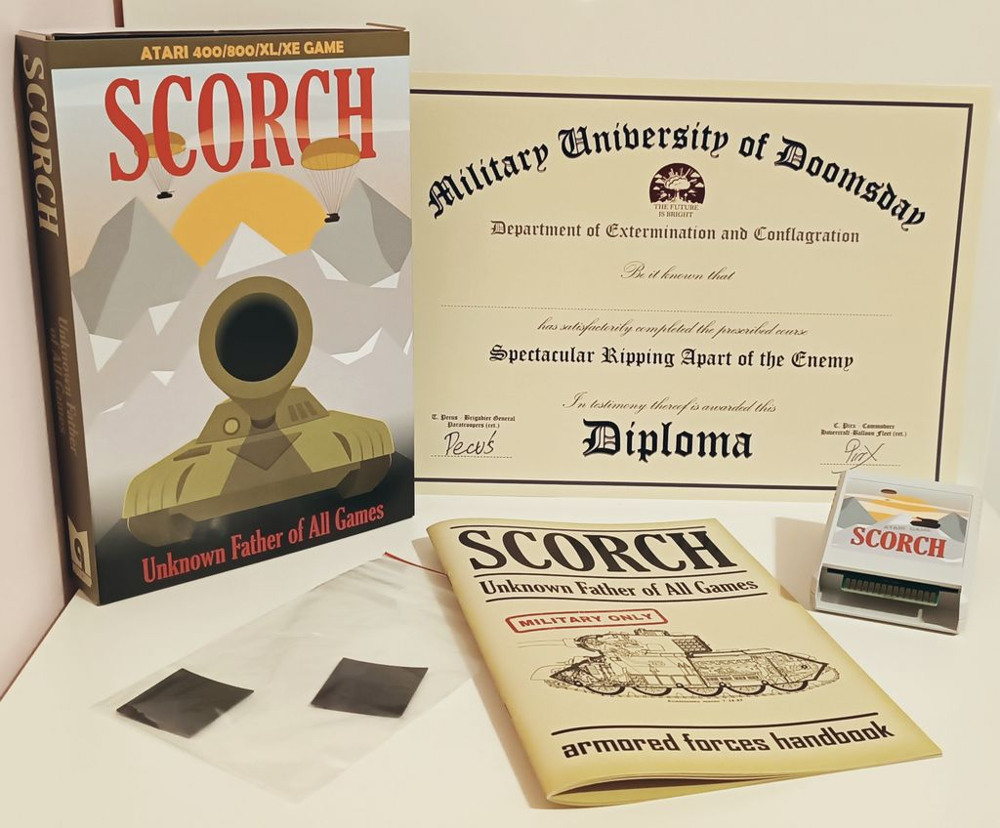
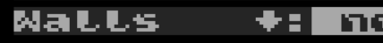

# Scorch - Atari 8-bit Scorched Earth clone source code
---------------------------------------------------

Scorch is a multi-player, turn-based, artillery video game. Tanks do turn-based battle in two-dimensional terrain, with each player adjusting the angle and power of their tank turret before each shot.

by Tomasz 'Pecus' Pecko and Pawel 'pirx' Kalinowski

Warsaw, Miami 2000, 2001, 2002, 2003, 2009, 2012, 2013, 2022, 2023, 2024, 2025

[Game manual in PDF (layout by Bocianu)](Manuals/scorch_manual_en.pdf)

Contributors:
- Miker ([mikerro](https://github.com/mikerro)) - in-game music and sfx, ideas, QA
- Kaz - original splash screen, SV Atari 50 splash screen, ideas
- Adam ([6502adam](https://github.com/6502adam)) - font, design, QA
- Bocianu ([bocianu](https://github.com/bocianu)) - important ideas, FujiNet implementation, QA, DTP
- Emkay - splash screen music
- Fox ([pfusik](https://github.com/pfusik)) - plot and point optimization
- xorcerer ([xauberer](https://github.com/xauberer)) - AI generated splash screen

QA: Probabilitydragon, EnderDude, Dracon, Beeblebrox, KrzysRog, lopezpb,
brad-colbert, archon800, nowy80, Saberman, Shaggy the Atarian, RetroBorsuk, ZPH,
x=usr(1536), Aking, RB5200

Special thanks to tebe ([tebe6502](https://github.com/tebe6502)), JAC! ([peterdell](https://github.com/peterdell)) and phaeron ([Altirra](https://www.virtualdub.org/altirra.html)) for their fantastic tools and support.

You can contact us via [AtariAge](https://atariage.com) or [AtariOnLine](https://atarionline.pl) forums.

This source code was originally compiled with [OMC65 crossassembler](https://github.com/pkali/omc65) and on 2012-06-21 translated to [mads](https://github.com/tebe6502/Mad-Assembler).

Compilation: (requires mads newer than 2023-09-13)
- `mads scorch.asm -o:scorch.xex -d:TARGET=800` for Atari800 version
- `mads scorch.asm -o:scorch.bin -d:TARGET=5200` for Atari 5200 version
- `mads scorchC64.asm -o:scorchC64.prg` for C64 version (WIP, not playable yet)

Update of the official Atari 8-bit cartridge from Mq:
- boot `scorch_fl.atr` from e.g. SIO2SD, SIO2PC or a large floppy
- insert the cartridge
- do what the flasher application says on the screen.
- do not despair if something goes wrong, just reboot, the reinsert cart, etc.
- it is smoother with QMeg OS, because there you can insert the cart, turn on your Atari, jump to the QMeg menu, and boot the `scorch_fl.atr` from there. No need to insert the cart into the running Atari.

WARNING | ADVERTENCIA |警告 | AVERTISSEMENT | चेतावनी  | WARNUNG | ПРЕДУПРЕЖДЕНИЕ | UWAGA | POZOR !!!
This is not an official cart manufacturer's (Mq) flasher, it is a collective and separate community effort. Be responsible, don't drink and flash your car(t). Better yet, do not flash it at all. In fact, to preserve the historical value of the artifact we strongly discourage from opening the game box and inserting the cartridge anywhere, especially into unauthorized orifices.

Game source code is split into several parts:
- `scorch.asm` is the main game startup code
- `scorchC64.asm` is the main game startup code for the Commodore 64
- `game.asm` - it all happens here
- `grafproc.asm` - graphics routines like line or circle
- `textproc.asm` - text routines like the list of weapons and shop
- `variables.asm` - all non-zero page variables
- `constants.asm` and `constants_top.asm` - various tables of constants 
- `ai.asm` - artificial stupidity of computer opponents
- `weapons.asm` - general arsenal of tanks
- `definitions.asm` - label definitions, moved to make it work better with Altirra debug (it doesn't).

Hardware dependent code (In the corresponding folders - 'Atari', 'C64', ...):
- `display_*.asm` - display lists and text screen definitions
- `gr_basic.asm` - graphics primitives (plot, point, soildown, drawmountains, etc.) for faster drawing
- `inputs.asm` - keyboard and joystick routines
- `interrupts.asm` - interrupts routines (DLI on Atari, music and SFX, timers)
- `textproc.asm` - text routines for menus and shop

We were trying to use macros, pseudo-ops, and simple graphics primitives as much as possible. This way, it should be relatively easy to port this code to, for example, the C64.

After working on this piece of code for N years, we are sure it would be much wiser to write it in C, Action!, or MadPascal. On the other hand, it is so much fun to type 150 characters when all you want to have is y = a * x + b. :)

Originally, most variables were in Polish, and comments were sparse. However, we wanted to release this piece of code to the public. Because we were always short of time and energy (to finish the game), we decided to translate it into English so that other people could work on it. This never happened, but we received some encouraging comments, and we are still trying to do something from time to time.

With the advent of [fujinet](https://fujinet.online/) we are thinking about making the game interplanetary, err, with multiplayer over the net. We'll see.

## Changelog:

###### Version 1.51
2025-01-15

We are done.

1. VU meters do not activate when the music is turned off. (Previously, after a set time, the tanks would rotate their turrets to position 0, and nothing would happen because there was no music. Now, they don’t even rotate at all.)

2. A slightly faster and significantly shorter circle-drawing procedure (the circles are a tiny bit less pretty 🙂).

3. Plasma Blast! (only as one of the tank destruction visual effects).

4. Better keyboard handling (thanks Gorgh).

5. Very rare interrupts problem fixed.

###### Version 1.50
2024-03-15

Atari 8-bit cart flasher and bug fixes!

@RB5200 provided us with a very good bug report so the new version was inevitable. Additionally, we have used [cart flasher](https://github.com/jhusak/jataricart/tree/master/various_flashers/1MBscorch) from @jhusak to prepare the .atr with flasher.

Fixes and changes:
- Napalm and Hot Napalm animations were not playing.
- Wind of force 0 and left direction was wrapping arithmetic and caused very strong left shoots.
- Now 0 force wind has got no direction (no negative zeroes anymore!)
- CTRL+Tab was nonfunctional for some time; returned
- Much nicer easter egg visualization.

###### Version 1.48
2024-03-11

New cart image, bugfixes, and easter eggs.

In preparation for the festive season we have squeezed the code a bit more, fixed some buggies, and added an easter egg or two :)

Most important changes:
- Cyborgs prefer attacking human players again! Due to unforeseen circumstances, Cyborgs were a bit shy and not as vicious as planned. Fixed.
- A new weapon "Propaganda". In the spirit of a ["Phoney War"](https://en.wikipedia.org/wiki/Phoney_War) instead of dropping bombs we drop a bunch of leaflets. This will show them!
- Robotanks were making suboptimal purchase decisions. Fixed.
- Updated binary manuals.
- ... _redacted_
- ... _redacted for egg season_
- A new physical cart image - you can update carts and have even more fun now!

###### Version 1.43
2023-12-07

Physical release version.
We are extremely pleased to inform you that our humble game was released on physical media by [Mq](mailto:mq666xx@gmail.com) (Atari 8-bit version) and 5200 [atariage.com](https://atariage.com/store/index.php?l=product_detail&p=1305).

The most important changes:

- Massive code and data optimizations make this dense mo********er of a code even denser. Circa 1KiB gained and reused for fixes and improvements listed below.
- New weapon - "Punch". Push the enemies to their oblivion!
- Black Hole option! Tanks can fall out of the screen. Press TAB when in the "Walls" main menu section to activate this option, indicated by "↓".

- Second fire in Joy 2B+ standard fully supported. Different joystick types can be used simultaneously.
- New option - random mountain heights for each round! Press TAB when in the "Mountain" section of the main menu, indicated by "?".
- Meteors cross the night sky!
- English and Polish language executable manuals for use in a cart.
- Significant acceleration of mountain drawing.
- Default tank names based on their AI levels.
- MaxForce fix (starts from 990 as it should).
- Hovercraft landing fix.
- Speedup of the main menu display.
- The "Stomp" weapon radius depends on Force.
- Super fast dirt fall with SFX, available by pressing [START] or in the menu.
- Speed-up of screen clearing, text operations, "Napalm" and "Diggers".
- Unnecessary clearing of offensive texts removed.
- Flicker in inventory and store eliminated.
- Cyborg and Spoiler aim better, added barrel animation and sound to AI aiming.
- Ancient "Digger" bug fixed.
- Revamp of the status bar, multiple fixes. additional and faster updates.
- Faster plot and point operations with some generated tables.
- Faster circle drawing, faster draw routine.
- Cyborg's battery optimization and SFX, other AI defensives SFX added.
- Fix of Autodefense bug, SFX added.
- Tank names sometimes disappear when using Lazy Darwin - fixed.
- Better "Laser" visualization in Lazy Darwin.
- Cart startup menu with a hidden easter egg.
- Turbo mode added to 5200 version (press and hold [START] key for a speed up).
- "Visual debug" mode is available in 5200 as well (long press of [#] toggles this mode).
- AI searches for the weakest link much faster now.
- Improved attack tactic of Poolshark, Tosser and Shooter.
- Miraculous powers of "Long Schlong"!!!
- Exit from AI aiming bug fixed.
- Chooser, Spoiler and Cyborg better calculate distances from explosions.

###### Version 1.30
2023-05-21

Okay, okay, we promised that the single-machine game was done, and it was. However, some bug reports came in, and the development of the C64 version unearthed some mostly peaceful and dormant pests. As a result, it appears that a new release is happening.

The most important changes:
- Most machine-dependent code moved to appropriate folders (`Atari/` and `C64/`).
- Game Over results table improved by sorting all 3 values - points, hits, and money earned. It was possible in the past to get a lower podium place with e.g., more money.
- The Game Over screen now displays a level of robo tanks and controller number for organic players.
- Gains calculations bug fixed.
- Manuals now include pictures!
- More than 6 tanks possible (not for Atari / 5200 where sprites and memory are the limiting factor)
- Shield stays up after the White Flag bug is fixed https://github.com/pkali/scorch_src/issues/138. Finally!!!
- Quit from the game and quit to Game Over is now checked much more often, especially when robo tanks are fighting.
- Numerous binary size and source code clarity improvements, mainly to facilitate the above changes.

###### Version 1.28
2023-04-22

Greetings and salutations,

Allow me to present the release notes for Version 1.28 of our esteemed hobby game for 8-bit computers.

First and foremost, let it be known that we have reached the end of an era. We bid adieu to the solitary player versions, as we are determined to preserve the sanctity of this auspicious round version number.

Moving on to the technical enhancements and embellishments, we are proud to introduce a simulated stereo feature for those fortunate enough to possess the dual pokey hardware. This auditory wonder was brought to fruition by the esteemed Arthur "Two Pokeys" Jackson, whose mastery in the field of sound engineering knows no bounds.

Furthermore, we have bestowed upon our beloved creation a splash screen of unrivaled brilliance, crafted by the masterful xorcerer. This work of art, by the Artificial Unintelligence and Machine Forgetting, shall leave an indelible mark on all who behold it.

Our developers have also painstakingly refined the game's performance with a plethora of improvements, including a refined round and final results sorting mechanism, additional keyboard usage assistance in the main menu, and a significant acceleration of the 8x8 and 4x4 put char routines. Additionally, we have incorporated configurable hardware and screen memory layout agnostic put char routines to accommodate future ports and ensure seamless compatibility.

Last but certainly not least, our mountain drawing optimization shall elevate the visual experience to new heights, ensuring an immersive and enjoyable experience for all.

We hope that these improvements will enhance your gaming experience, and we eagerly anticipate your feedback.

Yours sincerely,

The Developers

###### Version 1.27
2023-02-07

Late evening edition. It is 2:11 am and I am writing this instead of dreaming of electric sheep.
Our Senior Executive Art Director @+Adam+ ordered us to stop procrastinating and finally release the version with colorized mountains. So here it is. Enjoy :)
Please note you can still press [Tab] or [5] in the main menu and revert to the classic or classy look of the "Polish rainbow" (it's a reference to a strangely accurate Wulffmorgenthaler comic strip: https://i.imgur.com/HMctP.jpg)
Other changes:
- nicer Lazy targeting and "visual Debug" for Lazy Boys
- extreme memory optimizations to fit 2 new texts from @RB5200 based on "Sandford and Son"
- fix for [G] key bug, when turn wind changes, were selected
- fix for Lazy Boys deactivation bug
- PAL mode now has the full-color table, so it is possible to adjust colors better
- the x-position of tanks was always adjusted to even X values, this is no more, which saves some hassle and unnecessary tank shakes left and right. As tanks are painted with sprites of a lower resolution, a rare artifact might appear here and there.
- improved tank shapes

###### Version 1.26
2023-01-23

Early morning edition. It is 5:11 am and I am writing this instead of dreaming of electric sheep.
For the last 6 weeks, the versions we released had an awful bug - the conversations of tanks were completely invisible. Thanks for pointing this out, RB5200.
- tanks talk to each other again
- better stochastic non-blocking wait for one frame
- rare distance measurement bug fixed (rarely a tank survived a direct hit)
- 5200: second fire (by RB5200)
- "visual debug" mode in A800 version, triggered by pressing [CTRL]+[HELP]. It displays distances measured, laser aiming, and aiming technique. It leaves a mess on the screen, but it does not impair the game, just makes it a bit harder.

###### Version 1.25
2023-01-17

Y2K Compliance Edition
This version is 5200 SuperSystem focused.
- the correct production year in the splash screens!!!
- very rare hangups when accessing the inventory seemingly eliminated, thanks @RB5200 for testing!
- a new feature - pressing [Tab] (atari800) or [5] (5200) when selecting the wind power switches wind mode to changing with each turn, which makes aiming arguably more challenging! It is indicated by "?" next to the "Wind" in the main menu.
- pressing [G] during the game changes the color scheme (classic, Polish rainbow, Xmas).
- all these changes were made possible thanks to the extensive code size optimization by @Pecus

###### Version 1.23
2023-01-01

New year edition! Who could imagine?
The new feature is that pressing [Tab] in the main menu now changes colors of the small tank area down the screen and makes it clear what color version you are going to run (classic/ Polish rainbow/ Christmas colors).
Also a small gradient optimization. 

###### Version 1.22
2022-12-24

Christmas colors edition! Can you carve a quarter of a page of memory from two decades old code? Sure @Pecusx can! So finally we have the most requested feature - C0L0RS on the game screen, adjusted with Adam's help.
Press [TAB] twice in the main menu to switch to a screen with colors.
Other (dubious) improvements:
- The new Lazy Darwin, it is spectacular, check it out!!!
- Smoke Tracer does not smoke when targeting with Lazy Darwin
- Lazy Boy works well with joystick
- Another fix for self-destructing tanks shooting low angles (0-4 degrees)
- New, better tank shapes by Adam
- Barrel start point correction fixes very rare aiming issues
- Soil slide after Hovercraft usage optimized

###### Version 1.21
2022-12-10

We couldn't resist! This is the Senior Executive Director's Cut.
By virtue of byte misering we squeezed in a few new features:
- new selectable tank shapes - change the controller enough times to get a different tank model
- lonely bad pixel after Liquid Dirt fixed
- mountain colors (or shades) possible, switch with [Tab] in the main menu
- active controller number display in the game, store, and inventory screens
- a very special terminator mode for Moron

###### Version 1.20
2022-11-23

It's the final cut. Director's Cut.
We squeezed the code and saved some bytes to add the joystick/controller selection. No more fights for the stick, up to 4 players can have fun with their own manipulators. And the fifth one can still use the keyboard :).
Our most prolific testers Arek and Alex called for a number of fixes. Thank you, guys!
- Players can select their controllers.
- Better Auto Defense symbol in the status line.
- Battery performance in AI and Auto Defense fixed.
- More accurate and faster Laser.
- Boost For Gifts includes a secret, quite powerful weapon.
- Points counting fix-up (edge cases eliminated).
- Long lists in inventory and shop were pointing to a weapon outside the screen. Fixed.
- Lazy Boys now remember the last weapon used.
- Especially for XEGS - SELECT key changes the joystick similarly to TAB.
- Rare P/M glitches fixed.
- ExplosionRange variable glitched (rarely) due to byte/word mix-up. Fixed.
- Bouncy Castle was bouncing the laser from inside. Fixed.
- Shielded tanks were autodestructing when shooting with angle 0. Fixed.
- The physics of bouncing off the walls was incorrect for some weapons. Fixed.

###### Version 1.19
2022-11-04

This is the final round of weapon additions! Also. our beloved testers and players found a number of issues and we were extremely happy to address them.
- New defensive weapon "Lazy Boy" - aims at the closest enemy.
- New defensive weapon "Lazy Darwin" - aims at the weakest link, an enemy I mean.
- New defensive weapon "Auto Defense" - activate it to be automatically protected by shields and stuff (where available)
- New defensive weapon "Spy Hard" - quickly view energies, weapons, and shields of your opponents.
- New SFXes, improvements in SFX, and music by @mikerro
- Shooting with angle 0 caused the sudden death of the operator. Fixed.
- Angles were asymmetrical, now you can go from 0 to 90 and to 0 again (181 degrees of freedom). Fixed with an improved arithmetic rounding of our sub-pixel accuracy.
- Drawing a barrel when a tank was on the edge of X==256 pixels caused a lonely pixel to appear randomly. Fixed.
- Liquid Dirt was overflowing from the right edge of the screen to the left. Fixed.
- Liquid Dirt volume increased significantly, it is now a formidable attack!
- A single pixel was erroneously plotted when measuring distance (was visible in e.g., Death's Head). Fixed.
- Not all traces were correctly erased after Funky Bomb, fixed again (for the 3rt time I guess).
- Soil sedimentation speed after Funky Bomb improved.
- Pressing [ESC] when in inventory/store was quitting the game, now it quits the menu only.
- A bug in MADS optimization was causing parts of the SEPPUKU message to stay on screen.
- BIGGEST OF ALL: the lonely pixel after Nuclear Winter was eliminated. https://github.com/pkali/scorch_src/issues/103 We have spent a disproportionately large amount of time trying to slap this bug. It is still there, but is not manifesting itself ;)

###### Version 1.18
2022-11-07

Possibly the final single-player version of the game, unless our dear players find another breaking issue!
- 5200 keypad works as it should. You can now press these finicky foils to your heart's desire.
- "Unknown" type Robotanks were attacking with Nuclear Winter every time. Fixed!
- One of the variables was declared as a byte but used as a word that might cause some rare instabilities.
- Page zero variables are cleared prior to the game start to eliminate rare issues in some software/hardware configurations.
- The new version of the music in NTSC eliminates issues with tempo (not that anyone but the artist noticed that, but still it is an improvement!)
- You can now wrap around inventory and shop to faster access these options far down below.
- Visual improvement of the main menu and fixed some color issues with the title headers.
- Hovercraft was always flying to the top of the screen, it was not intended, it is now hovering just above the mountains!
- The main menu does not blink now when changing options. This was a very minor thing but it bothered me to some extent. Fixing it required a complete rewrite of this portion of the menu.

###### Version 1.17
2022-10-31

Mostly 5200 console port and NTSC improvements.
- Updated songs from Miker do not require skipping frames on NTSC machines. Crucial for the next point.
- Bouncy Castle bouncing of Funky Bomb fixed https://github.com/pkali/scorch_src/issues/129
- 5200 version had various graphical and sound glitches. Although mostly harmless, it hurt our sense of aesthetics. First of all the flickering credits roll is all good now.
- Rare hang-ups on NTSC machines fixed
- Screen lowered down by 7 scan lines to help top status line on NTSC CRTs.
- 5200 ATTRACT mode not going away fixed
- Autorepeat added to menus what should help 5200 users with their non-centering abomination of a controller.
- DLI interrupts optimized, few cycles saved.
- 5200 keypad sort-of-works. Please refer to the manual for key bindings.

###### Version 1.16
2022-10-16

The official release of our game for the Atari 5200 SuperSystem. Grab the `scorch.bin` file and burn a cart!
This is all thanks to @miker who supported us all this time of uncertainty and despair. 
Cramming the game into a 32KiB cart and 16KiB RAM was a big task - it required a rewrite of the RMT player, a crazy number of size optimizations, and counting each byte.

The release is not perfect - we have a number of glitches and improvements to the 5200 controller procedures to work on, but the game is playable.

Changes:
- numerous, but not very visible

###### Version 1.14
2022-09-05

Minor bug fixes and optimizations.
Just a small update to allow for more testing and having fun before the bigger release.

Changes:
- Numerous optimizations that require a solid test. Please have fun and report issues!
- Small DrawTanks fix.
- Bouncy Castle bounces like it should.
- Tracer and Smoke Tracer are not causing defense weapons to trigger anymore.
- In rare cases direct hit was not accounted for correctly.
- Manuals updated. https://github.com/pkali/scorch_src/releases/tag/v1.16

###### Version 1.13
2022-08-30

Getting ready for porting the game!

Several heavy optimizations and code cleanups in preparation for an unexpected port.

Changes:
- Overhaul of AI - Cyborgs, Spoilers, and Choosers aim much better.
- Cyborgs prefer to kill humans.
- Fine tuning of AI purchases makes the difficulty level aligned with the robot level.
- Fixed a very difficult and elusive bug that was causing tanks to freeze when falling close to the right edge of the screen.
- Updated music by @Miker
- It is now possible to enter tank names with a joystick - all essential game functions are available without touching the keyboard!
- Manuals updated with AI strategy information and more.

###### Version 1.12
2022-08-24

What is going on? Are we getting crazy or what?

Changes:
- Background color indicates the type of walls. This is very useful when the rand option is selected.
- XEGS users requested that console keys be used when no keyboard is attached! We delivered! [SELECT] to select an offensive weapon, [OPTION] to jump into inventory, defensive section, [START] + [OPTION] - immediate Game Over (no confirmation for you keyboardless folks)
- A very silly bug detected by our young testers fixed - the game crashed when you built a very high mountain using Dirt Balls :)
- Boxy infinite bounce bug fixed.
- Funky bombs bounce off the walls!
- The first letter entered for a tank name was inserted in the wrong spot. How did it work at all? Magic.
[ESC] now correctly exits the purchase screen.

###### Version 1.11
2022-08-22

A release lollapalooza.

The silliness indicator crashed. What are we doing?

Changes:
- A very silly buffer overflow bug fixed - it allowed for infinite (well... to the point) lengths of tank names, or rather for overwriting code with arbitrary values.
- Gamefield walls added https://github.com/pkali/scorch_src/issues/50. Choosing a different wall effect from the main options menu allows for a sophisticated tactics change. 

###### Version 1.10
2022-08-21

My hovercraft is full of eels.

This release brings a swath of gameplay updates and a generous dose of a new silliness.
[English](https://github.com/pkali/scorch_src/blob/master/MANUAL_EN.md) and [Polish](https://github.com/pkali/scorch_src/blob/master/MANUAL_PL.md) language manual drafts are available in the repository. Please help us with the English one as we are not native speakers.
Version number bump reflects the number of unreleased versions and amount of changes.

Changes:
- Defensive weapons can be activated before the round to make for the unbeatable aiming precision of the robotanks.
- Fixed bug with Long Schlong activation taking one Schlong too many.
- Smoke Tracer not disappearing smoke fixed.
- Bug allowing for infinite shooting outside the screen fixed.
- Tank colors and P/M sequence as devised by Adam, the gfx artist. Tanks differ more and look better. https://github.com/pkali/scorch_src/issues/119
- New item in the shop - loot box "Buy me!" with a surprise inside. https://github.com/pkali/scorch_src/issues/97
- Tank names can have  s p a c e s  now! https://github.com/pkali/scorch_src/issues/120
- Tanks are mobile now thanks to the new defensive option - Hovercraft https://github.com/pkali/scorch_src/issues/52
- The main Atari library switched to a more standard version based on Mapping the Atari
- Huge memory optimizations to allow for the new features.
- Narrow screen in shop/inventory (many bytes saved).
- Explosion range corrections for a rare event of non-lethal Nuke explosions.
- Pressing [A] jumps into defensive weapons activation directly.
- The elusive randomize force error causing rare hangups for Tosser fixed.
- Activation of defensive weapons moved to the front.
- Additional SFX for new weapons.

###### Version 1.00
2022-08-13

Silly Version 1.00
This is an official Silly Venture Summer Edition Atari 50 release. The game reached version 1.00.

The game manual is available at https://github.com/pkali/scorch_src/wiki
All 48KB+ 8-bit Atari computers are supported.

Thank you @Pecusx and @Miker for your hard work over the last few weeks - I was almost entirely absent because of the real-world attack.

Most important changes:
- New Game Over screen with a summary of wins, direct hits and earned cash. https://github.com/pkali/scorch_src/issues/9
- Tank barrels are drawn procedurally to make aiming easier..
- Various SFX and music updates with new tunes for all parts of the game. https://github.com/pkali/scorch_src/issues/112
- AI can use a White Flag.
- 3 different tank shapes https://github.com/pkali/scorch_src/issues/64.
- All AI levels are programmed. Cyborg is tough! https://github.com/pkali/scorch_src/issues/40
- New weapon - Long Schlong!
- New splash screen.
- Game mechanics improved.
- [O] key skips to the Game Over screen.
- The game works on Atari 800.
- Huge amount of optimizations to squeeze the game into 48K.

And now the new adventure begins!

###### Build 148
2022-07-17
WHAT DOES THE FOX SAY?

Fox (x0f, @pfusik) says plots and points can be optimized by 18 clock cycles each and thanks to his 6502 wizardry the game is noticeably nicer. Thank you!
Other changes:
- https://github.com/pkali/scorch_src/issues/99, https://github.com/pkali/scorch_src/issues/98 - tank number 6 has got a color now! No one is monochrome now! 
- https://github.com/pkali/scorch_src/issues/110 much-improved laser - previously it was almost useless, now it looks and works much better
- fixed an interesting roller bug
- Auto Defense angle fix
- multiple improvements in AI routines, and preparation for the final opponents.
 
###### Build 147
2022-07-10
LOST build. We were watching [LOST party](https://www.lostparty.pl/2022/) streams so maybe a little less done, but still some nice improvements.
- new weapons by @Pecusx - Napalm and Hot Napalm. Fire penetrates all shields, so beware!
- status bar showing outdated info at the beginning of the round fix
- various small optimizations of memory usage, soildown, weapon ranges, and others
- improved shapes of Heavy and Force Shields

Issues closed:
- revert to the old but slightly improved version of showing angles (#105)
- zero page loading eliminated (#106)
- active player name appears over his tank when aiming (#107)
- configurable mountain heights (The Netherlands, Belgium, Czechia, Switzerland, Nepal) (#86)
- angle speeds up when joystick/keyboard are pressed (#75)

###### Build 146
2022-07-03
Super heavy rewrite build.
Not much changed visually since the last build, but really large parts of the code were rewritten, optimized and improved. A fresh swath of buggies was certainly introduced, too. 
- completely new tank falling routine by @Pecusx - over 300 bytes saved, complexity reduced, more just energy deduction when falling.
- The silly angle system was rewritten to a proper, primary school angling. BTW - I had to dig into 8th grade trig to make it work. About 200 bytes were saved, and complexity reduced. The next build will have an improved angle speed UI. I will also allow for an easier improvement of tank visuals.
- Weapon price and quantity balance - this is our honest attempt to make the game more fun. We'll accept any critique and improvement proposals.
- New AI opponent - Tosser! Not much better than Poolshark, but still beats sharks most of the time.
- AI opponents can purchase defensive weapons which makes playing against AI somewhat more challenging.
- Improved Laser. It is still not ideal, but better. Still hard to aim :]
- A few small parachute-related bugs fixed
- Death's Head bug fix

Issues closed:
- https://github.com/pkali/scorch_src/issues/87 Angles are reasonable now. PROFIT!!!

###### Build 145
2022-06-26
Possibly the last round of weapon additions!

@Pecusx added 
- working White Flag -- it is a way to give up while not making opponents richer!
- Battery - a must for every tank with low energy.
- Strong Parachute - like a normal parachute, but stronger (it has energy and can work more than once)
- Nuclear Winter - a quick and efficient solution to global worming, err, warning, WARMING!

@mikerro added new SFX and in-game tunes.
- Pressing [S] turns on/off SFX (when aiming). Pressing [M] turns on/off in-game tunes.

Tickets closed:
- https://github.com/pkali/scorch_src/issues/54 - holding a joystick up or down speeds up force change. It makes playing with a joystick much nicer.
- https://github.com/pkali/scorch_src/issues/76 - a beginning of visual tweaks by @6502adam
- infinite defensive weapons purchase bug fixed, to the chagrin of some...

###### Build 144
2022-06-19
Father's Day release comes with the most anticipated new feature: defensive weapons. Thanks to @Pecus we have 5 completely new weapons and a more reasonably working parachute. The stub of the instruction manual describing these weapons is available here: https://github.com/pkali/scorch_src/wiki/Instruction-manual.

The new inventory system has been added. Call it by pressing the "I" key or short-pressing fire. Select the weapon to use by moving the joystick or cursor keys right. Switch between offensive and defensive weapons by moving the joystick left. Fire/escape to quit inventory.

Another significant playability change is #54 - it is not finished yet, but keeping the joystick up or down makes force increase/decrease faster. Also - the short press of fire calls Inventory, long press fires the shell. The timings are experimental, please let me know if this needs a modification/improvement.

Tickets closed:
- https://github.com/pkali/scorch_src/issues/92 - less unnecessary cleaning of the offensive texts
- https://github.com/pkali/scorch_src/issues/89 - improved collisions with tank
- https://github.com/pkali/scorch_src/issues/71 - ditto
- https://github.com/pkali/scorch_src/issues/11, https://github.com/pkali/scorch_src/issues/26, https://github.com/pkali/scorch_src/issues/8, https://github.com/pkali/scorch_src/issues/20 - new inventory system

###### Build 143
2022-06-05
Rewrite build. We redone several important parts of the game to allow for bug fixes and requested features. Generally, it was a great success, but some new bugs appeared. This build is nice for the eye, but beware, no mercy for testers again :)
Only visible changesare listed, because you are possibly not as excited as we are for the new Flight routine and ground collisions by @Pecusx.
- https://github.com/pkali/scorch_src/issues/84, https://github.com/pkali/scorch_src/issues/63 - tanks now say goodbye properly!
- https://github.com/pkali/scorch_src/issues/74 - Press [ESC] to quit the game at any point, with a confirmation when the round has already started. Please note the keyboard is not checked all the time, so press it for a while, especially when AI tanks are ru(i/n)ning the show.
- https://github.com/pkali/scorch_src/issues/56 - there should be no occurrences of frivolous weapon purchases. Please report all tanks getting their munitions from uncertified sources!
- https://github.com/pkali/scorch_src/issues/47 - It seems that the bad sequence of turns has been ameliorated. The fix is trivial, finding the culprit - far from it. Please pay special attention to the fairness of shooting in case the fix is still longing for the fjords.
- ATTRACT mode works how it should - screensaver saves screen only when HUMAN should input something.

###### Build 142
2022-05-30
Late build. The bugs we tried to squelch turned out to be more difficult than usual. Some progress has been made though even if it is not yet visible.
- 4x4 font rewritten by @Pecusx as a prep for Y standardization. It makes the messages to appear faster. This is a good change.
- https://github.com/pkali/scorch_src/issues/5 and #80 fixed (again) - no funkybomb traces staying on the screen
- https://github.com/pkali/scorch_src/issues/70 is too strong Shooters fixed
- https://github.com/pkali/scorch_src/issues/63 - tank says goodbye when (mostly) visible
- several other small changes and improvements that will pay off in the following releases.

###### Build 141
2022-05-22
Debug build. Thanks to all the testers for finding numerous bugs. We tried to fix some of them and we have introduced some new ones for your enjoyment.
- https://github.com/pkali/scorch_src/issues/73 Fast forward. Press [START] to speed up the game where it can be sped up. Not in many places, mind you.
- https://github.com/pkali/scorch_src/issues/72 Screen glitches improved
- https://github.com/pkali/scorch_src/issues/70 AI shoots with more force than their energy allows. We might still have to revise this one
- https://github.com/pkali/scorch_src/issues/69 Explosions wrapping around the screen
- https://github.com/pkali/scorch_src/issues/67 Screen glitches after the intro
- https://github.com/pkali/scorch_src/issues/65 Saved ~90 bytes by removing cosinus table
- https://github.com/pkali/scorch_src/issues/62 The Empty list of defensive weapons gets corrupted. Plunged it with a new defensive weapon - "White Flag". The honor of the tank crew prohibits them from buying it (yet)
- https://github.com/pkali/scorch_src/issues/61 [SHIFT] was repeating the last key
- https://github.com/pkali/scorch_src/issues/57 Fire is too sensitive on a real machine. Switched to shadow registers. First recorded use of Atari OS :O
- https://github.com/pkali/scorch_src/issues/55 Glitches in the status bar. This one was surprisingly tough.

###### Build 140
2022-05-15
Huge internal changes by @Pecusx. The whole game screen has been inverted - ground is now the background color, "sky" and empty areas are in fact pixels. This allowed for the introduction of better tank colorization, fully devised and led by Adam. The process started and results are already promising - the colors of tanks and the status bar are closer. We might get even better ones in the next builds.
- A few new sfx added (end of round, weapon change, soil eating weapons)
- added colors to tank name and level selection screen
- Bug https://github.com/pkali/scorch_src/issues/57 possibly alleviated by using TRIG0S instead of TRIG0. Please test - it did not show for me.
Other unlisted minor bugs and typos were fixed.
The "Nightly" version moved to the `develop` branch. `master` will be updated with stablish and playablish builds only.

###### Build 139
2022-05-09
The post-midnight release with great, heavy new features:
- https://github.com/pkali/scorch_src/issues/48, https://github.com/pkali/scorch_src/issues/10 - thanks to @mikerro we have a bunch of fresh sound effects. Not everything is perfectly implemented, but the game definitely got nicer! Thank you again, Miker!
- https://github.com/pkali/scorch_src/issues/42 New weapon - Liquid Dirt by Pecus. Try it directly from the weapon store!
- (fix) https://github.com/pkali/scorch_src/issues/53 - non-existing weapons are not displayed. This makes the defense menu empty when you are poor, but it is still better than the old way with "$0" prices
- (fix) https://github.com/pkali/scorch_src/issues/49 - seppuku should always kill now

###### Build 138
2022-05-02
- a new version of the font from Adam
- 80's style background gradient
- roller procedure refactored in preparation for liquid dirt

###### Build 137
2022-04-29
Premature release due to a trip to Atlanta on the weekend.
- https://github.com/pkali/scorch_src/issues/41 Make Riot Charge and Riot Blast weapons. YAY a new weapon after so many years! And it is really useful when you get covered by a ton of dirt
- land-slide optimization by @Pecusx: ~400 bytes and some cycles saved!
- nicer explosions (say that to the target)
- improved `wait` macro to be non-blocking (moving towards asynchronous code :)))
- various memory optimizations - over 9KiB free RAM for further use!

###### Build 136
2022-04-24
This is a very important release because we had a chance to work a bit as an original team (Pecus and pirx). Let's cheer for Pecus for joining the task force again! Changes:
- another sneaky memory-corrupting bug was found and fixed. The game seems to be as stable as an Ikea table! No bug number because it was super elusive.
- MIRV loops https://github.com/pkali/scorch_src/issues/6 - a very interesting one. It happened when MIRV killed tank exploded with LeapFrog or FunkyBomb.
- Nicer font https://github.com/pkali/scorch_src/issues/37 - Thank you Adam for digging up the font you made in 2008 :)
- Explosions are 2 times faster and look equally good or maybe even a bit better. This was a drag because of the Death's Head
- Memory map reorganized to extract some free RAM. Currentish map here: https://github.com/pkali/scorch_src/wiki
- Adam shared an archive that preserved a couple of the old build comments! Added below.

###### Build 135
2022-04-17
Happy Easter! This is a "premature ejacu.." err... "premature optimization" build. I got into an optimization fewer and got the code messed up, having to revert to the base. One important ticket closed:
- https://github.com/pkali/scorch_src/issues/35 Two morons shooting each other for more than 5 minutes. Added a new option "Seppuku". It causes one of the tanks ashamed of its inefficiency to detonate the weapon on itself. This was quite a difficult addition, requiring me to understand large swaths of the code, always a great challenge. Smoother gameplay with AIs guaranteed or money back.
Other small fixes:
- https://github.com/pkali/scorch_src/issues/23 High-flying MIRV leaves traces. Not anymore.
- https://github.com/pkali/scorch_src/issues/12 Make soil fall down faster after soil-eating weapons. Soil eating range is OK, it is the soil-down routine that is slow (but visually attractive).

###### Build 134
2022-04-10
- https://github.com/pkali/scorch_src/issues/34 - plot pointer visible only when a missile is out of the screen
- https://github.com/pkali/scorch_src/issues/33 - Poor AIs do not purchase non-working weapons
- https://github.com/pkali/scorch_src/issues/32 - Basic is turned off right at the beginning of loading. Dracon reported problems with running the game in Altirra, this was the best idea I had about it. Maybe next will be removing LZSS routine by @dmsc from the zero page 
- https://github.com/pkali/scorch_src/issues/31 - STA WSYNC removed from missile flight delay
- https://github.com/pkali/scorch_src/issues/30 - player level remembered between rounds, thx @KrzysRog
- https://github.com/pkali/scorch_src/issues/5 - funkybomb smoke stays on the edges of the screen

###### Build 133
2022-04-03
- bug: https://github.com/pkali/scorch_src/issues/7 tank stands on a single pixel spike. `WhereToSlideTable` vastly improved. 
- enhancement: https://github.com/pkali/scorch_src/issues/15 Add player colors to the purchase screen. Still room for improvement!
- enhancement: https://github.com/pkali/scorch_src/issues/22 Redesign information panel (top 2 lines of the game screen). Now game might make some sense for a newcomer :)
- change: https://github.com/pkali/scorch_src/issues/28 remove white lines around out-of-the-screen point tracker. Now it is visible and looks better!
- enhancement: https://github.com/pkali/scorch_src/issues/25 Missiles are too fast. Thanks @bocianu and @mikerro for the hint. The speed of the shell is configurable now, 5 speeds are available.
- enhancement: https://github.com/pkali/scorch_src/issues/27 Remember game settings between games.
- enhancement: https://github.com/pkali/scorch_src/issues/24 Remember player names between games. Thanks @bocianu

###### Build 132
2022-03-27
- fixed bug: https://github.com/pkali/scorch_src/issues/21 Wrong number of shells purchased
- fixed bug: https://github.com/pkali/scorch_src/issues/19 Inventory not cleared on next match. When fixing in a general way (cleaning all variables on game restart) I encountered a very old and nasty bug that made the game run basically by pure chance.
- fixed bug: https://github.com/pkali/scorch_src/issues/18 Selecting players using fire sometimes selects more than one. Rewritten keyboard handling to prepare for enhancements like #17
- tables of constants moved to a separate file, variables declared with .DS directive in preparation for memory map optimization.

###### Build 131
2022-03-20
- fixed bug: https://github.com/pkali/scorch_src/issues/4 It was a really hard one because I had to unspaghetti our own lousy code :]
- it is now impossible to purchase non-existing weapons.
- numerous edits/optimizations during the debugging process
- bug tracker moved to https://github.com/pkali/scorch_src/issues

###### Build 130
2022-03-13
- fixed bug: Decreasing of number of bullets after a shoot does not work correctly. It does look like it is fixed, although all  I did was move decreasing before shooting. Displaying the number of bullets immediately after the shoot.
- fixed a very difficult bug - the game was crashing from time to time, with corrupted code and/or screen. It was a digger digging lower and lower, finally digging through the code. Right now the game is not crashing on me.

###### Build 129
2022-03-06
- added tune by emkay, lzss player by dmsc
- fixed bug "When the result in points is >99 then only 2 first digits are displayed"

###### Build 128
2022-02-19
- fixed a bug making it harder to select AI level, unfortunately now player names can not include hyphens
- fixed numerous mistakes in handling bytes and words - possibly some of the crashes eliminated 
- adw addr #1 --> inw addr. 200 bytes shorter code (and maybe very slightly faster)

###### Build 127
2022-02-14
- option to select the number of rounds in a game
- rudimentary game over message (in results screen)
- game restarts

###### Build 126
2022-01-30
- fixed bug 006 (After some attacks the OffensiveText stays on the screen)
- fixed bug 015 (Only the first shoot of FunkyBomb is correct
- fixed bug 016 (No falling soil after leapfrog)

##### Build 125
2022-01-23
- included splash screen by KAZ

##### Build 124
2013-12-21
- removed large chunk of redundant 4x4 print code and table generation code,
  over 1kb gained.
- plot and point routines speeded up by ~20 cycles :P (and shortened by a few bytes as well)
- fixed bug 011. High-flying bullets sometimes cause brief screen garbage - like a DL damaged
  fixed by plot pointer (the top line) changed from HSCROLL based to regular $f line with plot
- screen memory moved to a low area ($1010), making the game start at $3010 and easier
  to load. Other minor memory layout modifications.

##### Build 123
2013-12-10
- fixed bug 013: sometimes demo mode does not work (it stops on results display)
- fixed bug 012: (newly introduced) Death explosions are offset right and possibly up.
- prepared the game for various screen widths. The only problem is the memory layout.
  Basically, it is impossible to make a contiguous wide screen of more than 170 lines.
  Changing the screen to non-contiguous would require a rewrite of all character
  manipulating routines.
- fixed bug 014: FunkyBomb shoots with too high an angle, 
  funkyBomb angle changed from -8..+8 to -16..+16
- speeded up explosions by drawing only odd circles. Not bad visually and 2x faster.

##### Build 122
2013-11-17
- tank expends 1 energy with each shoot to avoid endless shooting loops
- small visual glitch with the background color fixed
- death messages "defensive texts" in source do not stay on screen after some explosions

##### Build 121
2013-11-10
- Poolshark and Shooter can buy weapons
- Purchase screen moved to the beginning of the round

##### Build 120
2013-11-09
SillyVenture 2K13 joint effort to bring artificial intelligence into life:
- Shooter and Poolshark shooting programmed
- several small bugfixes and improvements as proposed by SillyVenture crowd 

##### Build 119
2012-06-17
Scorch sources translated to MADS with the sweet repl.sh script.

MISSING UPDATE INFORMATION... POSSIBLY NOTHING IMPORTANT HAPPENED HERE.

##### Build 115
2009-08-25
- fixed bug 001 (lack of explosions on the empty ground)
- fixed bug 003 (wrapping death's head explosions)
- fixed plot (faster explosions)
- fokk, just 6 years and we are back!!! This game is pretty addictive :)

TO DO:
- send our wives and kids away much more often :))))

##### Build 114
2003-08-22
- Results after each round are displayed on the right
  sequence, i.e. the best one is on the top
- during the second and following rounds of shooting sequence
  is such that the worst tank shoots first

The above changes do not look terrific, but there was
a lot of thinking to do it correctly. What is most
important is the overall game feeling improved a lot!

program.s65
- added routine SortSequence

textproc.s65
- changed routine DisplayResults to show round results in the correct order

##### Build 113
2003-08-17
Again you dear reader made us to do a significant improvement in Atari 8-bit Scorch. Build 113 released! There is a framework for AI ready and you can play with the most stupid opponent - the Mighty Moron!!! Give him a kick and play a little bit! 
- AI Opponents move barrels to the right position
  before firing a bullet.
- Purchase screen is not displayed for AI opponents.
- There is a 2 sec delay after displaying
  "Defensive" text i.e. text before death

program.s65
- added routine MoveBarrelToNewPosition which rotates the barrel of the tank until it sits at the right (newly randomized) angle

textproc.s65
- added routine PurchaseAI it is a framework for all AI purchases

SHORTSYS.S65
- new macro PAUSE (waits given number of frames)

##### Build 112
2003-08-15

The first attempts to create a framework for intelligent
opponents (AI). Right now there is only one level
of "intelligence" - Moron. 

Moron shoots at random angles with random force.

program.s65
- routine Round checks the Skill level and if it is not human branches to ArtificialIntelligence routine.
- new routines:
    - ArtificialIntelligence
    - RandomizeForce
    - RandomizeAngle

TO DO:
- nice rotating barrel of AI tank
- AI weapon purchase and usage
- AI better than Moronic... (but how...)
- tanks' shooting sequence should be from weakest to the strongest, not random

##### Build 111
2003-07-27

program.s65:
- added sequential shooting (not necessarily tank no. 1 shoots first)
- added routine "RandomizeSequence" that is called before each round
- the initial angle of the tank's barrel is randomized (was always 45 degrees right)

variables.s65
- added table "TankSequence"

grafproc.s65
- shorter delay during Flight

##### Build 110
2003-07-21
The previous release was a mistake. Build 110 is more or less playable, the "only" problem for now is such: in every round, there is the same sequence of shooting (1st, 2nd, 3rd tank, and so on). It should be like the weakest tank shoots first.

##### Build 103
2003-07-09
For the first time, Scorched Earth for Atari XL/XE (build 103) was published.
Together with Pecus we have been working on this piece of code for four years and it does not look like it is accelerating so we decided to publish what we have. Last few weeks I have been translating source code comments and labels to English to let other people work on this project with us. In other words, Scorched Earth becomes an open-source project :)
Now it's your turn to help this idea happen!

...transmission error...former history missing...

